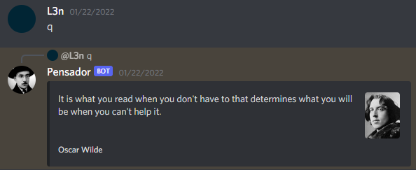

# Pensador

"Just another Discord bot, this one sends random quotes :)" sums it up.

It sends a random quote every [period](#period) you define.


There is also a command to get one as well.



## Required configuration

You need to create an `application.yaml` file, with the following fields filled:
```
discord:
  bot-token: 
  webhook:
    id: 
    token: 
  channel-id: 
  app-id: 
```
Then place it inside a `config` folder.

## Building 

Run `gradle quarkusBuild`, then copy the `build/quarkus-app` contents to the desired folder.

## Running

In dev, run `gradle quarkusDev`.

Otherwise, if it's already built, just run `java -jar quarkus-run.jar`.

Note: remember to have `config/application.yaml` in the folder you're running.

## Further configuration

### Quotes source

The bot has 2 possible sources it gets the quotes from: [goodreads](https://goodreads.com) (default) and [Pensador](https://www.pensador.com).

You can choose which one by specifying the `source` in the yaml. (`goodreads` or `pensador`)

### Period 

To change how often it runs, specify in the yaml as `cron-expr`. (
uses [quartz format](http://www.quartz-scheduler.org/documentation/quartz-2.3.0/tutorials/crontrigger.html)
by [default](https://quarkus.io/guides/scheduler-reference#quarkus-scheduler_quarkus.scheduler.cron-type))

By default is runs every 9, 12, 15, 18, 21 o'clock. 😳

## Quarkus guides

As you may have noticed, this project uses Quarkus.

If you're new to Quarkus, I have written two guides to help you understand its [dependency injection](https://davidsec.blog/2022/07/10/quarkus-cdi-guide/) and [configuration](https://davidsec.blog/2022/07/29/quarkus-guide-configuration/).
